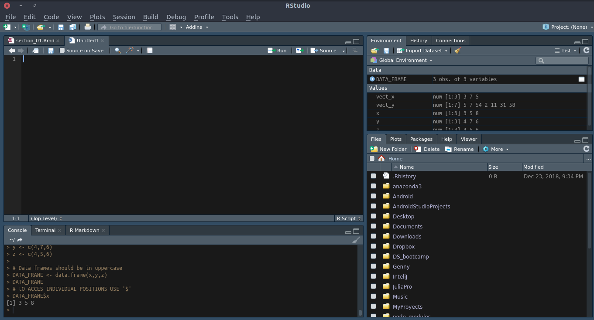

```{r setup, include=FALSE}
knitr::opts_chunk$set(echo = TRUE)
```

# 01 Introduction

Data science skills are in much demand today, but it is not just the mathematicians, statisticians, and the computer scientists who can benefit from acquiring them. Data science skills are for everyone!

In this course, I help you to begin using R, one of the most important tools in data science, and the excellent graphics package for R, ggplot2. Along the way, I also show you the basics of simple linear regression.

There are no prerequisites. We begin with installation of R and RStudio, and I introduce R and ggplot skills as they are needed as we progress toward an understanding of linear regression.

Students should be able to complete the course within two weeks, working at an easy pace.

Linear regression is a machine learning technique. I hope to create more courses like this one in the future, teaching machine learning, R, ggplot, dplyr, and programming, all at the same time.

What you’ll learn
- Install R and RStudio
- Create vectors and data frames in R
- Plot points and lines with ggplot
- Access vectors from data frames
- Group with ggplot
- Plot residual lines with ggplot
- Fit a least squares line to a data set
- Use a least squares line for prediction

Are there any course requirements or prerequisites?
You will need to install both R and RStudio on your computer. We will, however, cover this in the first lecture.

Who this course is for:
- This course is for beginners interested in using R.
- This course is for beginners interested in learning about the graphics package ggplot2.
- This course is for beginners interested in learning some basics of linear regression.
- This course is NOT for those with a background in statistics who use R and are familiar with ggplot2.

# 02 Installing R & R Studio

R can be installed this way: [How To Install R on Ubuntu 18.04](https://www.digitalocean.com/community/tutorials/how-to-install-r-on-ubuntu-18-04)

RStudio can be installed this way: [RStudio on Ubuntu 18.04 Bionic Beaver Linux
](https://linuxconfig.org/rstudio-on-ubuntu-18-04-bionic-beaver-linux)

# 03 A tour of RStudio
This image basically describes RStudio:


# 04 Vectors in R

## Value Assigment

This is the way to store values

```{r cars}
x <- 5 
y <- 5 

# this way we use a vector
vect_x <- c(3,7,5)
vect_y <- c(5,7,54,2,11,31,58)
# accesing values using coordinates
vect_y[2]
vect_x[5]

# accesing them using coloumns
vect_y[2:5]

# slice using negative numbers
vect_y[-2] # slice deleted number in position number 2

vect_y[-3] # slice deleted number in position number 3

vect_y[-2:-4] # slice deleted number in the range of positions

```


# 05 Data Frames
Data frames are fundametal in data analysis

```{r data frames}
x <- c(3,5,8)
y <- c(4,7,6)
z <- c(4,5,6)

# Data frames should be in uppercase
DATA_FRAME <- data.frame(x,y,z)
DATA_FRAME

# tO ACCES INDIVIDUAL POSITIONS USE '$'
DATA_FRAME$x
```
